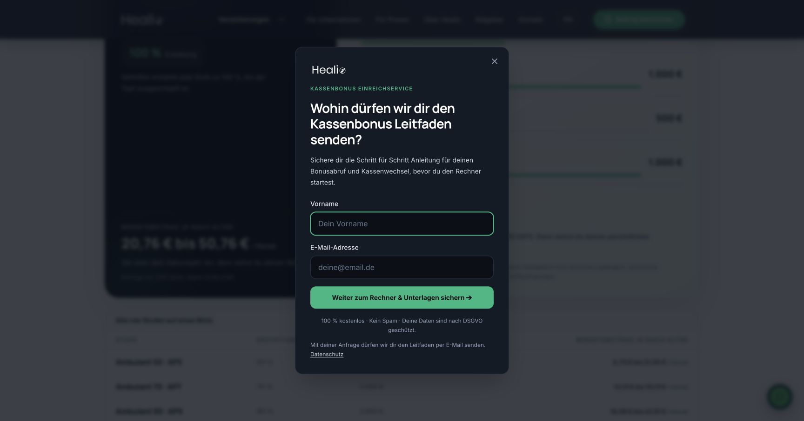

# Lead-Erfassung vor externen Beitragsrechnern

Stand: 09.10.2026. Die Lead-Erfassung nutzt das eigene Healio-CMS und einen einmaligen Leitfadenversand. Die Veröffentlichung folgt dem regulären Weg GitHub `main` → Vercel Auto-Deploy. Die Betriebsabnahme und der Mailtransport sind im [App-PR #3](https://github.com/Healio213/healio-app/pull/3) dokumentiert.

## Verhalten und Gestaltung

Vor dem ersten Versicherer-Rechner öffnet sich `src/components/LeadCaptureModal.tsx`. Es fragt ausschließlich Vorname und E-Mail ab. Die Komponente unterstützt `isOpen`, `onClose`, `targetUrl` und optional `trackingCategory`; der Integrationscallback `onExternalOpen` führt vorhandene Öffnungsereignisse erst nach tatsächlich bestätigter Fensteröffnung aus. X, Overlay und Escape schließen; Radix übernimmt Fokusfalle und Scrollsperre. Desktopbreite höchstens 460 Pixel, mobil ein Bottom Sheet mit eigenem Scrollbereich.

Original-Healio-Logo, die lokal geladenen Website-Schriften Inter/Manrope und dunkle Healio-Karten verbinden die neue Abfrage mit dem bestehenden Auftritt. Die Akzente verwenden die aktuellen Markenfarben über die gemeinsamen `home-mint`, `home-mint-active` und `home-midnight`-Tokens. Badge, Überschrift, Subline, zwei Pflichtfelder, Button und Microcopy entsprechen Franks Textvorgabe. Die Unterlagenanforderung dient einem einmaligen Versand; sie eröffnet keinen Newsletter.

Ein leerer Tab wird synchron beim Absenden reserviert, damit Browser den erst später bestätigten Rechner nicht blockieren. Die Versichereradresse wird erst nach `/api/lead-capture` → CMS-Erfolg geladen. Bei Fehler oder Abbruch schließt der leere Tab; die Eingaben bleiben bei einem Fehler erhalten. UUID und Zeitstempel bleiben bei identischem Retry gleich. Der Ladetext endet spätestens nach einer Sekunde; eine noch laufende Anfrage bleibt gesperrt und wird offen als solche erklärt. Nach zwölf Sekunden bricht der Client ab. Antworten aus früheren Anfragen können einen erneut geöffneten Dialog nicht verändern.

Nach Erfolg speichert `sessionStorage` nur das Wort `captured`, keinen Namen und keine E-Mail. Bei gesperrtem Storage übernimmt ein neutraler Status im Arbeitsspeicher. Weitere Anträge öffnen direkt. Bei Popupblockade zeigt der Dialog einen manuellen Rechnerlink; es entsteht kein zweiter Versandauftrag. Weiterhin blockierte Fenster zählen nicht als geöffnete Anträge.

[Handyansicht](screenshots/mobile.png)

## Integration

`LeadCaptureProvider` hält einen zentralen Dialog. `LeadCaptureLink` ersetzt die aktiven Versicherer-Antragslinks in Ambulant, im Bonusrechner, im UKV-Vorsorgebaustein, im Zahn-Check sowie in beiden Ambulant-Headerbuttons. Die bestehenden Vermittlerzuordnungen und Empfehlungsparameter bleiben erhalten. SDK, UKV und Bayerische werden über eine gemeinsame URL-Prüfung freigegeben. Ein abgefangenes Overlay ohne Absenden oder eine fehlgeschlagene Speicherung löst keine Öffnungsconversion aus.

Die freigegebenen Quellseiten umfassen Ambulant, Zahn, Kassenbonus, Tier und ihre englischen Varianten. Auf Kassenbonus existieren derzeit ausschließlich interne Produkt- und KassenBoost-Vergleichswege; Tier führt in das vorhandene Angebotsformular. Dort gibt es keinen externen Versicherer-Antragslink zu ersetzen. Beide bestehenden Wege bleiben ohne zusätzliche Kontaktabfrage. Einzelheiten: [Linkintegration](LINK-INTEGRATION.md).

## Eigenes CMS und Leitfaden

Die Website-Function leitet ausschließlich die vereinbarten Felder an `https://app.healio.de/api/website-leads` weiter. Das eigene CMS legt Anfrage und dauerhaften Versandauftrag atomar an. Neue Kontakte stehen unter `/admin/crm/website-leads`; die bestehende Empfehlungs-/Provisionslogik bleibt getrennt. Die App-Implementierung wurde über [App-PR #2](https://github.com/Healio213/healio-app/pull/2) auf dem bestehenden Hetzner-Server veröffentlicht; Runtime-Commit `775dfde43fa1a150285ae60f84093e0447399fef`. Datenbankmigration, Rollenabsicherung, Worker und täglicher Löschlauf sind eingerichtet. Reine Unterlagenkontakte werden im täglichen Lauf ab 90 Tagen gelöscht; eine noch gültige Versand-Lease wird zuvor beendet oder geklärt.

Der vierseitige Patientenleitfaden wurde aus aktuellen Originalquellen entwickelt und als PDF im tatsächlichen Healio-Design erstellt: Original-Logo, eingebettete Manrope/Inter-Schriften, Mitternacht `#07111F`, Mint `#25C990` und Creme `#FDFAF6`. Er enthält Bonusabruf, Nachweischeckliste, Kostenvergleich und Kassenwechsel samt Grenzen und Fristen. Zehn Quellen sind anklickbar. Die geprüfte Version liegt als `public/downloads/kassenbonus-leitfaden-2026-10-08.pdf` vor; SHA256 `3c8ebe5ad74499bbdcc67f8d3203064475bb45a184fcbe6f6c6d9acbe1184f79`.

Der eigene n8n-Workflow verwendet den eigenen CMS-Worker und die vorhandene gültige Brevo-Transaktions-API-Verbindung. Er legt keine Brevo-Kontakte oder Marketinglisten an. Der alte SMTP-Zugang wurde bei der Abnahme mit Authentifizierungsfehler abgewiesen. Ein unklarer Versand bleibt für eine bewusste manuelle Prüfung gesperrt; automatische Mailwiederholungen sind deaktiviert. Nur HTTP 201 mit gültiger Message-ID quittiert den Auftrag. Erfolgs-/Fehler-Ausführungsdaten enthalten keine dauerhaft gespeicherten Kontaktpayloads. Frank hat einen zusätzlichen Versuch des bestehenden synthetischen eigenen Testauftrags ausdrücklich freigegeben; dieser wurde vom Provider und vom empfangenden Mailserver bestätigt und im CMS als versendet quittiert. Die gestoppten Brevo-Strecken bleiben gestoppt.

Die Datenschutzerklärung beschreibt den neuen Datenweg auf Deutsch und Englisch. Die Website-Function hält Zugangsdaten ausschließlich serverseitig, prüft Herkunft, Größe, Formate und freigegebene Ziele und folgt keinen Webhook-Weiterleitungen. Ohne Empfangskonfiguration gibt es keinen vorgetäuschten Erfolg. Einzelheiten: [API und Client](API.md).

## Prüfnachweise

- `npm run test:lead-capture`: 38 API-/Client-Verhaltenstests bestanden. Validierung, Sitzungsstatus, bestätigte Navigation, Fehler, Idempotenz, Popupblockade, alte Antworten, Fokus, Overlay/Escape und Scrollsperre geprüft.
- Bestehende Conversion-, Datenschutz-, Google-Ads-, UKV- und Bonusmodell-Verträge bestanden.
- Gerenderte Bonusgrenzen und Tarifauswahl: vier Stufen, Beitrag/Budget, eigene Eingaben, Rücksetzen, DE/EN und mobile Hero-CTAs bestanden. Ein erster Bonus-Browserlauf während paralleler Prerender-Dateiänderungen lief in ein Timeout; derselbe unveränderte Test nach Ende des Builds bestand.
- Gezieltes ESLint für geänderte JS/JSX-Dateien und TypeScript-Prüfung des TSX-Dialogs bestanden.
- Chrome: reguläre Desktopbreite, 390-Pixel-Handy und 320-Pixel-Layout geprüft; kein horizontaler Überlauf, Scrollsperre und Anfangsfokus korrekt. Desktop- und mobile Headerbuttons öffnen den Dialog ohne externen Provideraufruf.
- Finaler Produktionsbuild mit aktuellem Marken-, Menü- und Blog-Stand bestanden: 245 Prerenders ohne Fehler; 268 Routen samt 178 Ratgeberseiten und 23 Blogartikeln geprüft. Versioniertes PDF ist im Build enthalten und bytegleich zur geprüften Vorlage.

## Freigabereihenfolge

App, Rollen-Guard, Empfangs-/Worker-Konfiguration, öffentliches PDF und Löschbetrieb werden vor dem Popup veröffentlicht. Ein eigener synthetischer Auftrag prüft Transportannahme, CMS-Quittierung und Zustellung getrennt. Anschließend wird nur der eigene Worker aktiviert und der geprüfte Website-Stand regulär über GitHub `main` → Vercel Auto-Deploy veröffentlicht. Die öffentliche API-Abnahme wiederholt ausschließlich die bereits gespeicherte Request-ID, sodass kein zweiter Kontakt und keine weitere Testmail entstehen. Keine lokalen Vercel-Uploads oder `vercel promote`.
